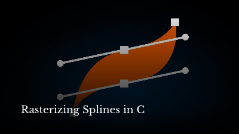
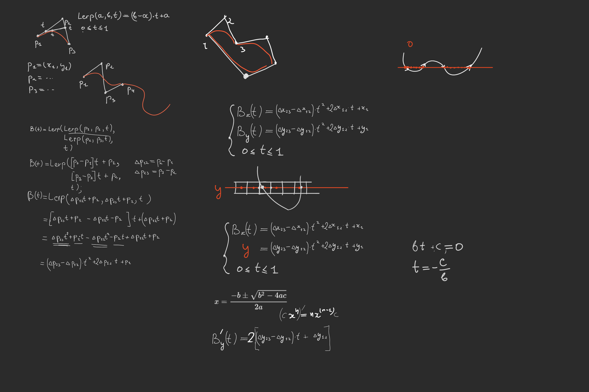

# Rasterizing Splines

The notes from the Rasterizing Splines stream:

[](https://www.youtube.com/watch?v=1epwf3iaQNU)

## Thirdparty Dependencies

We supply [Raylib for Linux](./raylib-5.5_linux_amd64/) with this repo (it's downloaded from [Official Releases](https://github.com/raysan5/raylib/releases/tag/5.5)).

This project also depends on [FreeType2](https://freetype.org/) but we do not supply it since it's too complex. But if you are on Linux it should be already available in your repos.

## Quick Start

```console
$ cc -o nob nob.c
$ ./nob
$ ./build/spline
$ ./build/font
```

## Blackboard

Blackboard from the session:


